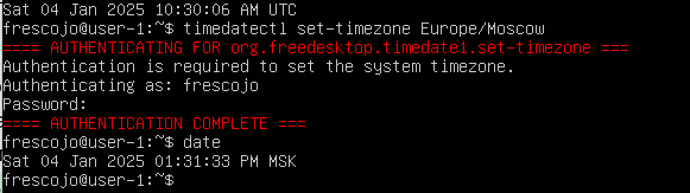
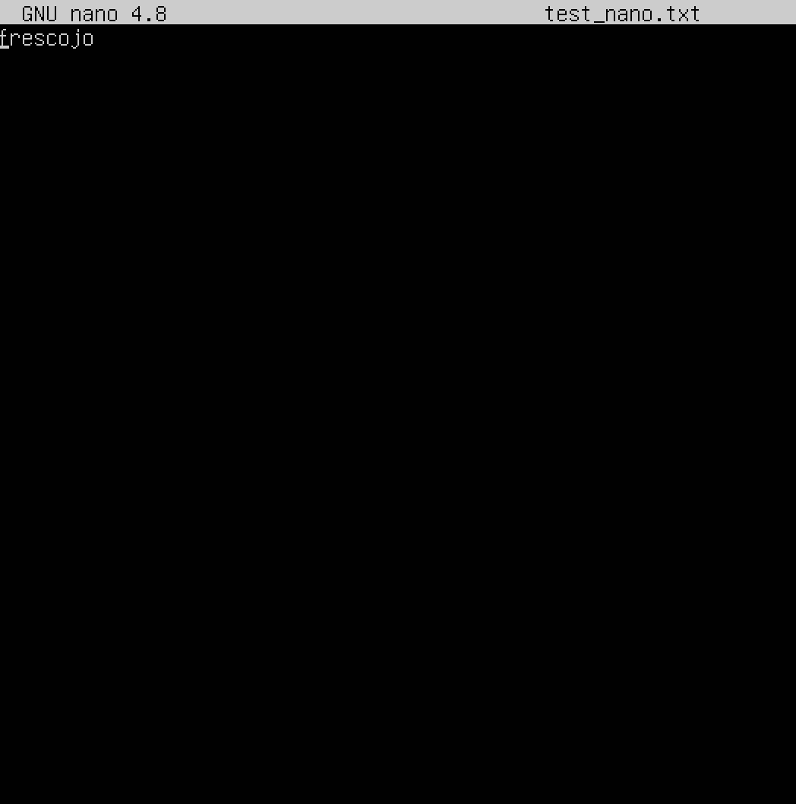
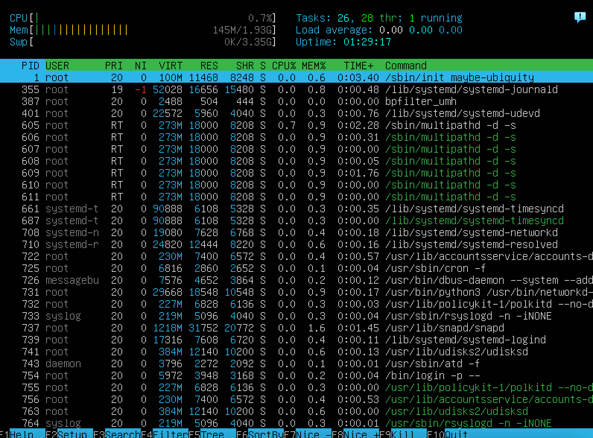
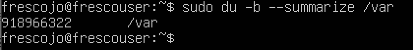
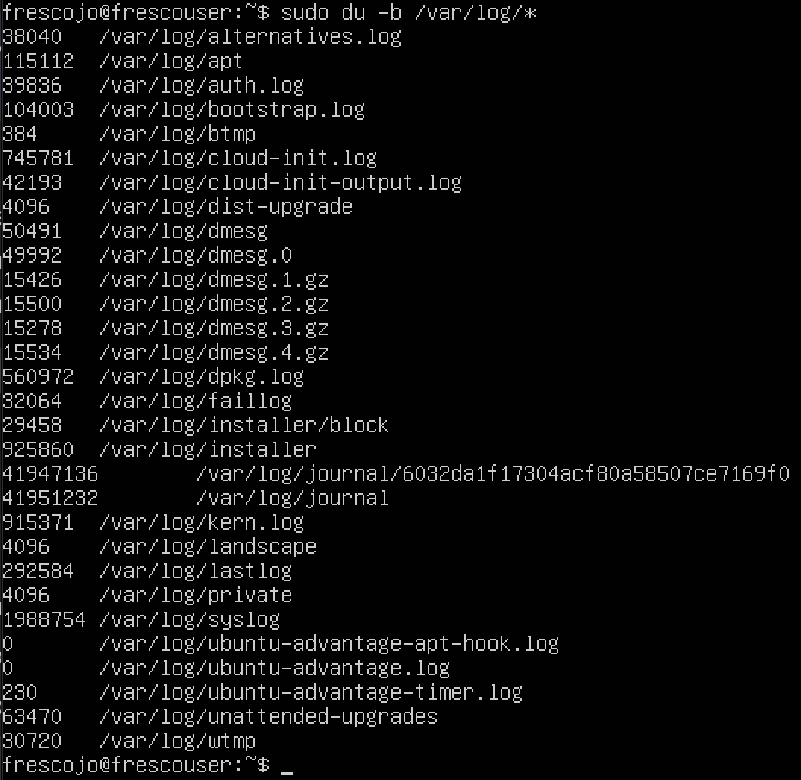

## Part 1. Установка ОС

<figcaption>Версия убунту</figcaption>

## Part 2. Создание пользователя

<figcaption>Создание пользователя и добавление его в группу adm</figcaption>

sudo adduser tolik - добавили нового пользователя с именем tolik
sudo usermod -aG adm tolik - добавили нового пользователя tolik в группу adm 

<figcaption>Вывод команды</figcaption>

Проверка, что пользователь tolik создан (в самом конце)

## Part 3. Настройка сети ОС

DHPC протокол автоматически назначает IP - адрес каждому клиенту 
IP адрес - уникальный номер устройства, подключенный к интернету или локальной сети, показывает в какой части сети находится устройство.
Принцип работы: 
1. Пользователь, не имеющий изначально IP, подключается к сети, в которой есть DHCP сервер, запрашивает у него IP адрес
2. На этом сервере хранится список IP-адресов для выдачи, который называется пулом. 
3. Клиент получает DHCPOFFER, а затем отправляет на сервер сообщение DHCPREQUEST. Этим сообщением он принимает предлагаемый адрес и уведомляет DHCP-сервер об этом. 
4. Сервер получает от клиента DHCPREQUEST и окончательно подтверждает передачу IP-адреса клиенту сообщением DHCPACK
5. Когда DHCP-сервер выделяет IP из области, он оставляет запись о том, что этот адрес зарезервирован за клиентом с указанием срока действия IP. Этот срок действия называется срок аренды (lease time). Срок аренды по умолчанию выставлен на 24 часа, но может доходить до нескольких дней, недель или даже месяцев. Период задается в настройках самого сервера.

Для работы в сети клиенту требуется не только IP, но и другие параметры DHCP — например, маска подсети, шлюз по умолчанию и адрес сервера.

/ Маска показывает, сколько битов включает в себя номер сети./
/ сетевой шлюз - это сетевое устройство, которое обеспечивает маршрутизацию данных между различными компьютерными сетями (wifi роутер - сетевой шлюз) /

1.

<figcaption>Имя хоста user-1</figcaption>

hostname - проверить имя хоста
sudo hostnamectl set-hostname новое_имя -  поменять имя хоста 
sude reboot -  перезагрузить 

2.

<figcaption>измененное имя хоста</figcaption>

<figcaption>Изменение временной зоны</figcaption>

timedatectl set-timezone Europe/Moscow - устанавливает таймзону

Интерфейс lo является локальной петлёй, имеющей IP-адрес 127.0.0.1. Она предназначена для обеспечения сетевого доступа к компьютеру.

3. 

<figcaption>Объяснение и установка net-tools ifconfig</figcaption>

утилита ifconfig находится в net-tools командой sudo apt install net-tools устанавливаем
потом ifconfig / sudo ifconfig получаем информацию 

Сетевой интерфейс (сетевой адаптер) — это часть аппаратного устройства, которая позволяет операционным системам и программам передавать данные через компьютерную сеть.

lo - петелвой интерфейс это виртуальный сетевой интерфейс, который используется для взаимодействия компьютера с самим собой. Он не связан с физическим сетевым оборудованием (например, сетевая карта или Wi-Fi адаптер), а существует только в операционной системе.
Петлевой интерфейс — это виртуальный интерфейс, который позволяет компьютеру отправлять и получать данные самому себе.
Он используется для тестирования сетевых приложений, локальной связи между программами и других задач, где не требуется выход в реальную сеть.

можно тестировать сетевые приложения, не подключаясь к реальной сети.
веб-разработчики часто используют localhost для тестирования сайтов.
+
программы на одном компьютере могут общаться друг с другом через петлевой интерфейс.

4. 

<figcaption>ip from DHCP</figcaption>

Dynamic Host Configuration Protocol (DHCP) - автоматически предоставляет пользователю IP

5.

<figcaption>внешний IP</figcaption>

Внешний IP адрес шлюза - это публичный IP адрес, который используется для выхода в интернет.(пр.адрес вашего роутера в интернете) Не хранится на компьютере, его можно узнать с помощью сторонних сервисов. 
сделано с помощью curl ifconfig.me

ifconfig.me - веб сервис, который дает информацию о внешнем IP устройства 
curl - утилита, которая позволяет получать ответы от веб сервисов 

<figcaption>внутренний IP</figcaption>

Внутренний - адрес, которой используется в локальной сети ,чтобы сконнектить устройства (пр. комп и роутер)
ip route - команда

6. 

<figcaption>новые настройки</figcaption>

sudo vim /etc/netplan/00..tab - файл в котором хранятся сетевые настройки 
маска (/24) - указывает какая часть статичная, а какая может быть изменена при установке IP(пр. 10.0.2.0/24 - /24- маска - последний 0 может быть изменен)
gw - шлюза

после установки всех натсроек, чтобы применить их: sudo netplan apply 

7.
sudo reboot - перезагрузка 

<figcaption>новые настройки после преезагрузки</figcaption>

<figcaption>пинг</figcaption>

Пинговать - данные в сети передаются пакетами, когда пингуем отправялем рандомно созданные пакеты и смотрим что нам возвращается, проверяем инфу доступно ли утройства и ск по времени занимает передача данных. 

ping -c 5 - с это count 5 - 5 пакетов, чтобы не было бесконечной пинговки 

additional info:
IP адрес устройства (машины)  - номер устройства в сети, нужен чтобы устройства могли общаться / обмениваться, без него устройство не сможет участвовать в сети

GW - шлюз это проводник между мной и другим устройством / сеть / инетом 

DNS - преобразовывает понятные человеку наименования типо google.com (адрес / название сайтов) в IP адрес 

## Part 4. Обновление ОС

<figcaption>обновление системных пакетов</figcaption>

sudo apt update - обновить список доступных пакетов 
sudo apt full-upgrade - обновить все системные пакеты 

## Part 5. Использование команды sudo

<figcaption>разрешение пользователю выполнять команду sudo</figcaption>

Для этого нужно добавить пользователя в группу sudo с помощью команды: 
sudo usermod -aG sudo <имя_пользователя> - -aG помогает добавить пользователя не удаляя его из остальных групп

sudo - это команда в linux которая позволяет делать больше. сделать что то важное не имея прав администратора, обычно комнады нет у всех пользователей, чтобы они не могли сломать систему. 

hostname - как называется машина в локальной сети 

<figcaption>изменение имени хоста </figcaption>

сначала мы переключились на второго юзера комнадой - su - имя пользователя 

потом sudo hostnamectl set-hostname <новое_имя> этой комнадой поменяли имя пользователя 

sudo reboot - перезагрузили машину, чекнули результат 

## Part 6. Установка и настройка службы времени

<figcaption>синхронизация времени</figcaption>

sudo systemctl status systemd-timesyncd - проверяем, что systemd-timesyncd установлена и запущена
Открываем файл sudo vim /etc/systemd/timesyncd.conf
Там исправляем NTP=time.google.com (это сервер, который можно использовтаь для синхронизации времени) NTP сервер — это устройство, которое предоставляет точное время другим устройствам в сети.

sudo systemctl restart systemd-timesyncd - перезапускаем службу 

timedatectl show - проверяем 

## Part 7. Установка и использование текстовых редакторов

1.

<figcaption>vim</figcaption>

esc + :wq - для сохранения 
i - для редактирования файла 

<figcaption>nano</figcaption>

ctrl + o , enter, ctrl + x - выход из nano с сохранением 

<figcaption>joe</figcaption>

ctrl +k , ctrl +x - сохранить и выйти 

2.

<figcaption>vim без сохр</figcaption>

затем команда esc , :q! - выйти без сохранения
резульат: 

<figcaption>vim без сохр</figcaption>

<figcaption>nano без сохр</figcaption>

ctrl +x , no - сохранить без изменений 

<figcaption>nano без сохр</figcaption>

<figcaption>joe без сохр</figcaption>

ctrl + c, y - выйти без сохр 

<figcaption>joe без сохр</figcaption>

3. 

<figcaption>vim search</figcaption>

esc + /[word] - vim search 

<figcaption>vim replace</figcaption>

esc + :s/word/new_word

<figcaption>nano search</figcaption>

ctrl + w + word - search word 

<figcaption>nano replace</figcaption>

ctrl + \ word , new word, yes

<figcaption>joe search</figcaption>

ctrl + k, f - joe search

<figcaption>joe replace</figcaption>

ctrl +k, f, R, word, new word - find and replace a word in joe 

## Part 8. Установка и базовая настройка сервиса SSHD

// SSHD - это программа, которая работает на сервере (компьютере) и позволяет други компьютерам 
подлключаться к нему безопасео

// у SSHD есть порт, через который происходит обмен данными, он по умолчанию 22, мы меняем на 2022
для улучшения безопасности, уменьшение хакерских атак

// ps - утилита, показывает информацию о запущенных процессах

sudo apt update 
sudo apt install openssh-server - установка службы SSHd

sudo systemctl is-enabled sshd - проверка автострата службы после загрузки системы disabled / enabled 

sudo systemctl status sshd - проверка статусы, должно быть active 

<figcaption>sshd active</figcaption>

Перенастройка службы SSHd на порт 2022

<figcaption>port 2022</figcaption>

sudo vim /etc/ssh/sshd_config

находим port 22
меняем на port 2022. убираем #

<figcaption>port 2022 active</figcaption>

sudo ufw allow 2022/tcp - разрешить порт

<figcaption>ps</figcaption>

ps -ef | grep sshd

ключи:
e - отобразить все процессы.
f - показать полный формат вывода 

<figcaption>netstat tan</figcaption>

TCP подключения - это соединение между двумя устройствами 
netstat -tan используется для отображения всех tcp подключений 
-t — отображать только TCP-подключения.
-a — показывать все подключения (активные и ожидающие).
-n — отображать IP-адреса и порты в числовом формате

## Part 9. Установка и использование утилит top, htop

1. top - это стандартная утилита для мониторинга процессов в реальном времени: 

<figcaption>top</figcaption>

uptime: 
user: 1
среднюю загрузку системы: 0.00
общее количество процессов: 99 
загрузка cpu: us - процессы пользователя , sy - системные процессы, id - бездейтсвие 
(в фото) 
загрузка памяти:  (в фото)
pid процесса занимающего больше всего памяти: (в фото) смотреть на %MEM
pid процесса, занимающего больше всего процессорного времени: (в фото) смотреть %CPU

2. htop - это улучшенная версия top с более удобным интерфейсом и дополнительными функциями.

сортировка по PID (fn+f6) (уникальный числовой, который ОС присваивает каждому процессу при
запуске):

<figcaption>pid</figcaption>

сортировка по percent_cpu(показывает, сколько процессорного времени использует процесс): 

<figcaption>cpu</figcaption>

сортировка по percent_mem(): 

<figcaption>mem</figcaption>

сортировка по time:

<figcaption>time</figcaption>
______

отфильтрованному для процесса sshd (показывает только те процессы, которые связаны с sshd):

<figcaption>sshd filter</figcaption>
______

с процессом syslog, найденным, используя поиск: 

Логи: Сообщения, которые записываются в логи, могут содержать информацию о системных событиях, ошибках, предупреждениях и т.д.
syslog - система для сбора и хранения логов

<figcaption>syslog</figcaption>

______

с добавленным выводом hostname, clock и uptime: 

<figcaption>uptime time hostname</figcaption>

## Part 10. Использование утилиты fdisk

fdisk -l команда позволяет просмотреть список дисков, их разделов, размеры, типы файловых систем 
и другую полезную информацию, только смотреть не изменяя ее

sudo fdisk -l (sudo - так как идет работа с низкоуровневыми данными)

название жесткого диска (устройство для хранения данных в компьютерах и других электронных 
устройствах): VBOX HARDDISK
его размер: 25G
количество секторов (минимальная адресуемая единица данных на жестком диске.): 52428800
размер swap: 2G (это важный механизм, который помогает системе работать при нехватке оперативной памяти)

<figcaption>fdisk -l</figcaption>

## Part 11. Использование утилиты df

df /, / - нужно отобразить информацию только для корневого раздела - утилита, 
которая показывает информацию о свободном и использованном пространстве на файловых системах (дисках и разделах)

размер раздела: 7540828
размер занятого пространства: 3361244
размер свободного пространства: 3869984
процент использования: 47%
выводит все в кибибайтах 

<figcaption>df</figcaption>

df -Th / 
-T — отображение типа файловой системы
-h — вывод размеров в удобном формате (например, ГБ, МБ).
/ — указывает, что нужно отобразить информацию только для корневого раздела

размер раздела: 7.3G
размер занятого пространства: 3.3G
размер свободного пространства: 3.7G
процент использования: 47%
тип файловой системы: ext4

<figcaption>df -th</figcaption>

## Part 12. Использование утилиты du

<figcaption>du</figcaption>

sudo du -b --summarize /home 
-b - в байтах 
-summarize - споказывает общий размер директории, не показывает размер отдельных входящих 
файлов и папок 
sudo - так как эти директории часто защищены от обычных пользователей

<figcaption>du </figcaption>

sudo du -b --summarize /var 

<figcaption>du </figcaption>

sudo du -b --summarize /var/log

_________

<figcaption>du </figcaption>

sudo du -b /var/log/*

## Part 13. Установка и использование утилиты ncdu

<figcaption>ncdu home </figcaption>

<figcaption>ncdu var </figcaption>

<figcaption>ncdu varlog </figcaption>

ncdu /home .. - выводит размер папок в KiB

## Part 14. Работа с системными журналами

Открыть для просмотра: cat /var/log/dmesg | less (чтобы можно было листать файл)

Журнал dmesg: Сообщения о загрузке ядра линукса 
Журнал syslog: системный лог-файл, в который записываются сообщения от различных компонентов системы: ядроб службы
Журнал auth.log:  информацию о попытках входа в систему, использовании sudo, действиях с правами root и других событиях, связанных с безопасностью.

Отчёт о времени последней успешной авторизации, имени пользователя и методе входа в систему

<figcaption>report </figcaption>

время, имя видно на скрине, вход pam_unix(systemd-user:session) -  что пользовательская сессия была открыта с использованием модуля pam_unix - проверяет, что данные, которые ввел пользователь (имя, пароль) существуею,  uid=0 - root / суперпользователь

<figcaption>sshd </figcaption>

сигнал 15 - перестает работать 

## Part 15. Использование планировщика заданий CRON

CRON - это планировщик задач, который позволяет автоматически выполнять команды 
или скрипты в заданное время

Задачи cron хранятся в cron-таблицах: системных и пользовательских
* * * * *  (команда) - мин час день мес день/нд
/2 - шаг в два
uptime - команда, которая выводит информацию о времени работы системы

<figcaption> cron </figcaption>

No MTA intsalled - если установлено, cron может отправлять отчет напочту пользователя

<figcaption> tasks </figcaption>

<figcaption> clear tasks </figcaption>