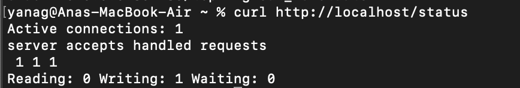

## Part 1. Готовый докер

Docker - система упаковки программ в изолированные контейнеры. Докер позволяет создать отдельный контейнер для каждого компонента итогового продукта, связать их и запустить как единое целое. 

Nginx - веб сервер, который получает запрос от пользователя и отдает ему его. Например веб сайт - пользователь запрашивает через nginx доступ к странице, nginx отправляет нужную страницу, то есть отдает файлы:  html, картинки, стили(css), скрипты. Используется много где, так как позволяет обрабатывать много соединений сразу. 
Nginx при запуске на компьюетере позволяет локально проверять программу, чтобы посомтреть как все будет работать на реальном сервере, так мы не зависим от интернета и проверяем все до выхода приложения. 

официальный докер-образ с **nginx** 
докер-образ -  это шаблон по которому создается контейнеры , содержит: 
саму программу (например, Nginx),
её настройки,
библиотеки,
зависимости,
информацию о том, какой порт слушать и какую команду выполнять при запуске.

официальный докер-образ с **nginx** - это уже настроенный к использованию шаблон, чтобы запустить сервер nginx 

1. 
Скачиваем официальный докер образ и проверяем его наличие 

<figcaption> докер образ </figcaption>

2. 
Запускаем докер образ и проверяем , что он работает. 

<figcaption> запуск </figcaption>

3. 
Смотрим полную информацию о контейнере, находим нужные пункты:

<figcaption> информация о контейнере </figcaption>

4. 
Размер базового образа nginx - сколько места занято образ докерами 

<figcaption> размер базового образа </figcaption>

5. 
Размер контейнера - размер контейнера проверили с помощью docker system df -v - проверяет сколько места занимают контейнеры на моем ПК
df -v — disk free тоже самое что и df 

<figcaption> размер контейнера </figcaption>

6. 
Ip конейнера - контейнер сам по себе можно сравнить с компьютером с минимальными базовыми настройками внутри компьюетра, iP нужен , чтобы устанавливать связь с другими контейнерами или выходить в интернет. Docker сам назначает каждому контейнеру уникальный адрес. 

<figcaption> айпи контейнера </figcaption>

7. 
Замапленные порты. Зачем нам нужен порт? Nginx - это уже собранный и настроенный мини сервер, у которого есть базовая страничка. Все это хранится в контейнере, но чтобы получить доступ к этой страничке и вообще к контейнеру нам нужен порт через который наш запрос и будет проходить в контейнер. 

<figcaption> замапленные порты </figcaption>

8. 
Останавливаем докер контейнер и проверяем, что остановили.

<figcaption> остановка контейнера </figcaption>

9. 
Запустила докер с портами 80 и 443 в контейнере, замапленными на такие же порты на локальной машине, через команду *run*
docker run -d -p 80:80 -p 443:443 nginx

docker run - создает и запускает новый контейнер 
-d - или --detach - Запускает контейнер в фоновом режиме. Это удобно, если не нужно взаимодействие с терминалом.
-p 80:80 - связывает порт 80 на моем компьютере с портом 80 внутри контейнера 
-p 443:443 
nginx - имя докер образа из которого создается контейнер 

<figcaption> порты </figcaption>

10. 
Проверила, что в браузере по адресу *localhost:80* доступна стартовая страница **nginx**.
localhost - внутреннее имя моего компьютера, которое указывает на него самого всегда. То есть , когда я пишу https://localhost - я говорю зайти на веб сервер , который работает на моей машине, а это nginx, поэтому мне показывает страничку 

<figcaption> localhost </figcaption>

11. 
Перезапустила докер контейнер. Проверила с помощью docker ps , что контейнер запустился.

<figcaption> restart + check  </figcaption>

## Part 2. Операции с контейнером

Сначала я запустила сервер: docker run -d -p 80:80 -p 443:443 nginx
Мне выдало имя:  dreamy_hermann 

1.  
Прочитала конфигурационный файл *nginx.conf* внутри докер контейнера через команду *exec*
docker exec dreamy_hermann cat /etc/nginx/nginx.conf
exec - от execute — команда для выполнения чего-то внутри работающего контейнера
/etc - тут находятся конфигурационные файлы 

<figcaption> запуск + exec </figcaption>

2. 
Создала на локальной машине файл *nginx.conf*.
Сохранила его локально для редактирования: docker exec -it dreamy_hermann cat /etc/nginx/nginx.conf > nginx.conf
> - содержимое файла из контейнера записывается в локальный файд nginx.conf на  моей машине 
Я его отредактирую, внесу изменения и загружу обратно в контейнер. 

3. 
В конфигурационном файле nginx.conf , который мы создали в предыдущем пункте, мы добавялем специальный блок location/status , который включает встроенную страницу статуса nginx. На этой странице показывается: 
- сколько активных соединений 
- сколько всего было запросов и соединений 

Но этой строчки server у нас нет в файле nginx, для удобства использует директиву include /etc/nginx/conf.d/*.conf, где как раз и будет эта строчка 

Блок server находится именно там, я проверила есть ли этот файл вообще, выполнив команду docker exec -it dreamy_hermann ls /etc/nginx/conf.d/ - файл этот у нас есть , мы заходим в него. 
_______

Настроила в нем по пути */status* отдачу страницы статуса сервера **nginx**.
Просмотрела файл docker exec -it  dreamy_hermann cat /etc/nginx/conf.d/default.conf
Открыла файл  nano default.conf для редактирвоания

И в этом файле добавила строчки: location /status {
    stub_status on; // включает внутреннюю страницу статуса Nginx
    access_log on; //логирование процессов
}

<figcaption> status </figcaption>

4. 
Скопировала созданный файл *nginx.conf* внутрь докер-образа через команду `docker cp`.
Закгрузила файл в контейнер 
docker cp default.conf dreamy_hermann:/etc/nginx/conf.d/default.conf - это с server 

5. 
Перезапустила **nginx** внутри докер-образа через команду *exec*.
docker exec -it dreamy_hermann nginx -s reload

6. 
Проверила, что по адресу *localhost:80/status* отдается страничка со статусом сервера **nginx**.
Сделала я это с помощью curl http://localhost/status

<figcaption> status </figcaption>

7. 
Экспортировала контейнер в файл *container.tar* через команду *export*.
docker export dreamy_hermann > container.tar

Првоерила, что он есть 

<figcaption> check container </figcaption>

8. 
Остановила и удалили остановленный контейнер 

<figcaption> остановка и удаление контейнера </figcaption>

9. 
Удалили образ через `docker rmi [image_id|repository]`, не удаляя перед этим контейнеры

<figcaption> удалили образ </figcaption>

*** Если я экспортировала контейнер и затем хочу импортировать его обратно, вот , что не сохраняется из моих настроек nginx:
Хоть Nginx и настроен на порт 80, при импорте теряются метаданные Docker, включая:

Инструкцию EXPOSE 80 (которая была в оригинальном образе nginx).
Команду запуска (CMD ["nginx", "-g", "daemon off;"]).
Итог:

Контейнер запускается, но Docker:
Не пробрасывает порт 80 на хост (если не указать -p 80:80).
Не запускает Nginx автоматически (если не указать команду вручную).

10. 
Импортировала контейнер обратно через команду *import*    
docker import container.tar test-import

<figcaption> импорт + запуск </figcaption>

11. 
Запустила импортированный контейнер.
Проверила, что по адресу *localhost:80/status* отдается страничка со статусом сервера **nginx**.
docker run -d -p 80:80 test-import nginx -g "daemon off;"   

<figcaption> проверила localhost </figcaption>

## Part 3. Мини веб-сервер

Что мне тут нужно сделать? Мне нужно сделать мини веб сервер, которые возвращает одну страничку 
со строчкой "Hello,world!", то есть пользователь обращается к этому веб серверу через nginx, 
который обрабатывает запрос пользователя и выдает ему страничку. 
Это все равно, что если бы я создала веб сайт , к которому пользователь может обращаться через интернет, 
веб сервис nginx будет получать запрос пользователя и возвращать нужную страничку веб сайта. 

1. 
FastCGI. Проблема в том, что nginx не умеет выполнять С-код.
FastCGI решает эту проблему, он позволяет 
- получать HTTP запросы (запросы от бразуера клиента на сервер) от пользователей
- передавать их программе на Си (через порт 8080)
- возвращать результат обратно в браузер 

Написали в файле server.
Скомпилировала файл с помощью команды  gcc server.c -o server -lfcgi

2. 
Запустила написанный мини-сервер через *spawn-fcgi* на порту 8080. с помощью команды spawn-fcgi -p 8080 -n ./server &
Выдало: [1] 46355
[1] - ID задачи (job number) в текущей сессии терминала
47985 — PID (Process ID) вашего сервера в системе
kill 47985 - для остановки сервера 

Команда spawn-fcgi:
Запустила скомпилированный сервер (./server)
Привязала его к порту 8080
Перевела в фоновый режим (благодаря & в конце команды)
Сервер теперь работает в фоне и готов принимать запросы через FastCGI.

3. 
Написала свой *nginx.conf*, который будет проксировать все запросы с 81 порта на *127.0.0.1:8080*. 
Находится в /server/nginx/nginx.conf

Nginx принимает запросы от пользователей на порту 81 и перенаправляет их вашему серверу на порт 8080 через FastCGI-протокол.

4. 
Запустила локально **nginx** с написанной конфигурацией.
sudo nginx -c $(pwd)/nginx.conf 

5. 
Проверила , что в браузере по *localhost:81* отдается написанная мною страничка.

Или коротко: ______

1. Компилирую файл
gcc server.c -o server -lfcgi
2. Запускаем 
spawn-fcgi -p 8080 -n ./server - в 1 терминале
lsof -i :8080 - проверяем что слушает - в др терминале
3. sudo nginx -c $(pwd)/nginx.conf - запустили (нгинкс / если нужна остановка sudo nginx -s stop)
4. http://localhost:81

## Part 4. Свой докер

1. Написала докер образ. Включила туда все необходимое. 
2. Собрала написанный докер образ командой docker build -t myapp:1.0 .
3. Запустила собранный докер образ командой docker run -p 80:81 myapp:1.0

Проверила через `docker images`, что все собралось корректно.

<figcaption> docker image </figcaption>

Запустила докер образ.
Проверила, что по localhost:80 доступна страничка написанного мини сервера `docker images`, что все собралось корректно.

<figcaption> запуск докер образа </figcaption>

Пересобрала образ проверила статус

<figcaption> status  </figcaption>

Что имеем? 

1. Сервер на Си. Выдает страничку  Hello, world! , слушает порт 8080
2. Nginx конфиг слушает порт 81. Принимает http-запросы от пользователя. Передает запросы на FastCGI-сервер. Может показывать статус. 
3. Баш скрипт. Очищает старые процессы, компилирует сервер, запускает FastCGI-сервер на порту 8080, запускает nginx.

## Part 5. **Dockle**

Изначально было вот такое количество предупрждений после команды dockle. 

<figcaption> dockle initial  </figcaption>

INFO - CIS-DI-0008: 
  * setgid file: /usr/sbin/unix_chkpwd
  * setuid file: /usr/bin/passwd 

- не изменить, так как эти файлы являются частью базовой системы Linux внутри образа nginx:latest
Они нужны для работы системных функций (проверка паролей, управление пользователями).

INFO - CIS-DI-0005: 
  * export DOCKER_CONTENT_TRUST=1

- не нужно изменять, это не проблема моего образа, а настройка всей системы Docker.

Исправленные ошибки: 
1. CIS-DI-0001: Create a user for the container
Контейнер запускается от имени root, что небезопасно. Атакующий может получить полный контроль, если скомпрометирует контейнер.

2. CIS-DI-0006: Add HEALTHCHECK - проверка работоспособности контейнера. Опциональный вариант, не обязателен для исправления, но добавлен в докер 

Итоговый вывод dockle: 

<figcaption> dockle result  </figcaption>

Все работает:

<figcaption> access valid  </figcaption>

## Part 6. Базовый **Docker Compose**

Написала докер compose 

<figcaption> docker compose  </figcaption>

Подняла два контейнера.
Отдает страничку 

<figcaption> containers  </figcaption>

*** В контейнере nginx написала конфиг файл , который принимает запросы от пользователя и отправляет их на другой (1) контейнер. 

proxy_pass http://app:81 - перенаправляет на другой(1) контейнер на порт 81, на котором слушает внутренний nginx 

Первый контейнер (app / server)
Что внутри:
1. FastCGI-сервер на C (server.c)
2. FastCGI-демон spawn-fcgi
3. Nginx (внутренний), который слушает порт 81
 Задачи:
1. Принимать запросы от внутреннего Nginx
2. Передавать их FastCGI-серверу
3. Обрабатывать логику на C
*** Работает только внутри Docker-сети и не доступен напрямую из браузера

Второй контейнер (nginx_server)
Что внутри:
1.Nginx (обратный прокси)
 Задачи:
2. Принимать внешние HTTP-запросы от пользователя
3. Проксировать их в первый контейнер на http://app:81