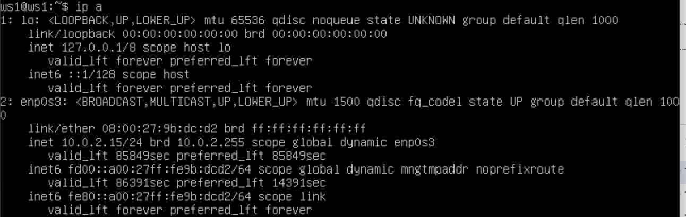
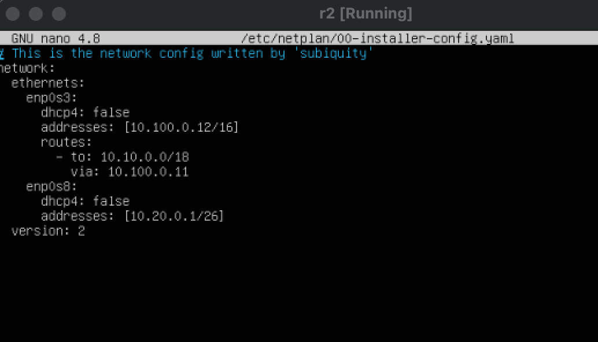
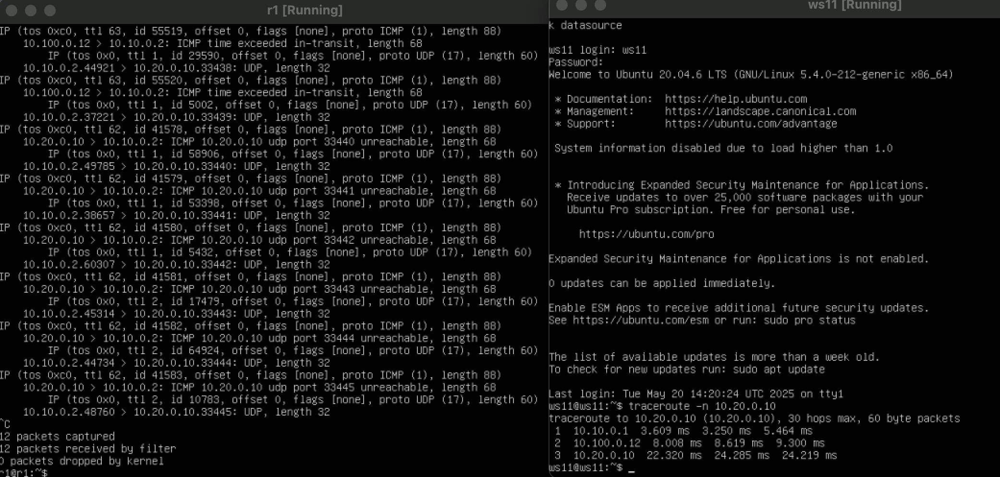
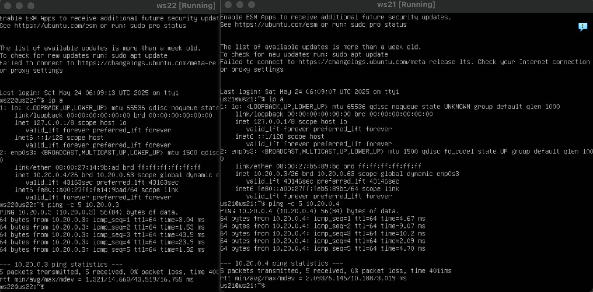

## Part 1. Инструмент ipcalc 

1.1 Сети и маски 

ВВОДНАЯ ИНФА 

IP адрес - уникальный адрес устройства в сети, состоит из 32 битов. 
/.. - маска. показывает сколько из 32 битов уйдут на адрес сети. 
Сеть / адрес сети - общий адрес для всех устройств, подключенный к одной сети. 
Хост - адрес / номер устройства 
________

1. Адрес сети 192.167.38.54/13 - 192.160.0.0

<figcaption>адрес сети</figcaption>

2. Префиксная запись, двоичная и обычная 

0.0.0.0 / 255.255.255.0 - десятичная форма маски / обычная 
Префиксная - 24
Двоичная - 11111111.11111111.11111111.00000000

<figcaption>255.255.255.0</figcaption>

_______

0.0.0.0/15 - префиксная форма маски 
Обычная - 255.254.0.0
Двоичная - 11111111.11111110.00000000.00000000

<figcaption>/15</figcaption>
_______

0.0.0.0/255.255.255.240 (потому что это обычная запись двоичной маски 11111111.11111111.11111111.11110000)
Обычная - 255.255.255.240
Префиксная - 28

<figcaption>11111111.11111111.11111111.11110000</figcaption>

3. Минимальный и максимальный хост 

12.167.38.4 /8 
Мин: 12.0.0.1
Макс: 12.255.255.254

<figcaption>мин макс хост 12.167.38.4 /8 </figcaption>
________

12.167.38.4 /11111111.11111111.00000000.00000000
Мин: 12.167.0.1
Макс: 12.167.255.254

<figcaption>мин макс хост 12.167.38.4 /11111111.11111111.00000000.00000000</figcaption>
________

12.167.38.4 /255.255.254.0
Мин: 12.167.38.1
Макс: 12.167.39.254

<figcaption>мин макс хост 12.167.38.4 /255.255.254.0</figcaption>
_________

12.167.38.4 /4
Мин: 0.0.0.1
Макс: 15.255.255.254

<figcaption>мин макс хост 12.167.38.4 /4</figcaption>

1.2 Localhost 

Localhost - это псевдоним для нашего собственного компьютера. По умолчанию localhost связан с IP-адресом 127.0.0.1 - это адрес, который всегда указывает на нашу машину. 

Для чего используется? 
Тестирование веб приложений, все данные хранятся на компьютере и не отправляются в сеть. 

Localhost — это способ обращения к вашему собственному компьютеру через loopback-интерфейс. Он использует IP-адрес 127.0.0.1 и весь диапазон 127.0.0.0/8.

Чтобы выполнить задание - нужно понять остносится ли данный IP адрес вот к этому диапазону от 127.0.0.0 до 127.255.255.255 (он зарезирвирован для lookback интерфейса( виртуальный сетевой интерфейс, который существует только внутри вашего компьютера. Он используется для того, чтобы программы могли обмениваться данными с самим собой, не выходя в реальную сеть))

194.34.23.100 - нельзя, внешний IP адрес (адрес, который идентифицирует устройство в сети)
127.1.0.1 - можно, входит в диапазон 
127.0.0.2 - можно, входит в диапазон  
128.0.0.1 - нельзя, внешний адрес

Это также можно сделать через ping 
ping — это утилита для проверки доступности сетевого устройства по IP-адресу. Она отправляет ICMP-пакеты на указанный адрес и ждёт ответа. Если устройство доступно, вы получите ответ.

<figcaption>2 ip адреса, которые входя в диапазон </figcaption>

1.3. Диапазоны и сегменты сетей

1.
Диапазоны частных IP-адресов:
10.0.0.0/8 (10.0.0.0 – 10.255.255.255)
172.16.0.0/12 (172.16.0.0 – 172.31.255.255)
192.168.0.0/16 (192.168.0.0 – 192.168.255.255)

Диапазоны private - все, что не в частных
_______

10.0.0.45 - private 

<figcaption>тип ip адреса 10.0.0.45</figcaption>

134.43.0.2 - public 

<figcaption>тип ip адреса 134.43.0.2</figcaption>

192.168.4.2 - private (Все IP-адреса в диапазоне Class B (кроме зарезервированных) являются публичными.)

<figcaption>тип ip адреса 192.168.4.2</figcaption>

172.20.250.4 - private

<figcaption>тип ip адреса 172.20.250.4</figcaption>

172.0.2.1 - public

<figcaption>тип ip адреса 172.0.2.1</figcaption>

192.172.0.1 - public 

<figcaption>тип ip адреса 192.172.0.1</figcaption>

172.68.0.2 - public 

<figcaption>тип ip адреса 172.68.0.2</figcaption>

172.16.255.255 - private

<figcaption>тип ip адреса 172.16.255.255</figcaption>

10.10.10.10 - private 

<figcaption>тип ip адреса 10.10.10.10</figcaption>

192.169.168.1 - public 

<figcaption>тип ip адреса 192.169.168.1</figcaption>

2.

10.10.0.0/18 

<figcaption>ip адреса шлюзов</figcaption>

Выше мы видим диапазон Host Min , Host Max и широковещатель , все , что не в этом диапазоне - не подходит

10.0.0.1 - не подходит 
10.10.0.2 - подходит 
10.10.10.10 - подходит 
10.10.100.1 - не подходит 
10.10.1.255 - подходит 

## Part 2. Статическая маршрутизация между двумя машинами

Команда ip a - смотрим существующие интерфейсы.
Имя сетевого интерфейса — это уникальный идентификатор, который система присваивает каждому физическому или виртуальному сетевому устройству.

NAT - это подключение к интернету 

<figcaption>ws1 ip a</figcaption>

<figcaption>ws2 ip a</figcaption>

Поменяла содержимое конфигурационного файла для ws1 и настроила ip адрес внутренней сети 

<figcaption>поменяла содержание конфигурационного файла</figcaption>

Поменяла содержимое конфигурационного файла для ws2 и настроила ip адрес внутренней сети 

<figcaption>поменяла содержание конфигурационного файла</figcaption>

2.1 Добавление статического маршрута вручную

Чтобы добавить статистический маршрут между двумя машинами, я задала ip адрес одной и другой,
прописала это в конфигурационном плане netplan , в настройках сети сменила NAT (выход в интернет)
на внутренняя сеть, у обоих машин. С чем у меня была проблема? С net-tools - на одной машине он был
не обновлен, из-за внутренней сети не было возможности скачать и установить пакет утилит, нужно было 
поменять сеть опять на NAT. (enp0s3, если этот интерфейс имеет выход в инет, NAT, ставим в netplan dhcp4: true, потому что именно dhcp выдаст нам IP -уникальный номер устройства в сети, чтобы мы смогли с ней взаимодействовать )

Пропинговала 2 машину с 1, связь установлена 

<figcaption>пропинговала </figcaption>

Пропинговала 1 машину со 2 , связь установлена 

<figcaption>пропинговала</figcaption>

2.2 Добавление статического маршрута с сохранением

Так как машины находятся в одной сети нам не нужен адрес шлюза для установления коннекта 

<figcaption>поменяла содержание конфигурационного файла</figcaption>

<figcaption>поменяла содержание конфигурационного файла</figcaption>

Пропинговала , пакеты получены 

<figcaption>пропинговала</figcaption>

<figcaption>пропинговала</figcaption>

## Part 3. Утилита iperf3

3.1 

По возрастанию: бит, килобит, мегабит, гигабит, терабит 
В бите 8 байт. 
Компьютеры работают с битами (0,1)
Биты (Kb, Mb) — для скорости передачи (интернет).
Байты (KB, MB) — для хранения данных (файлы).
Процессоры обрабатывают данные блоками по 8, 16, 32, 64 бита

Формула для перевода из мегабит в секунду Mbps в мегабайт в секунду MB/s
Мегабиты - скорость интернета, мегабайты - скорость скачивания файлов. 

MB/s = Mbps / 8
Answer: 8 Mbps = 1 MB/s

Формула для перевода из мегабайт в секунду MB/s в килобиты в секунду Kbps
1 мегабайт MB = 1024 килобайт 
1 килобайт = 8 килобит 

Kbps = MBs * 1024 * 8 
Answer: 100 * 1024 * 8 = 819,200 Kbps

Формула для перевода из гигабит в секунду Gbps в мегабит в секунду Mbps
1 GB = 1024 MB
Answer: 1024 Mbps

Чтобы измерит скорость соединения - на одной машине мы подключаем сервер ipef3 -s, а
на другой подключаемся к серверу и отправляеи тестовые данные и наоборот. 

3.2 

<figcaption>измерила скорость соединения</figcaption>
На одной машине - iperf3 -s - слушаем 
На другой машине - iperf3 -c |ip 1|

## part 4 Сетевой экран 

4.1 

Файрвол - система / программа, которая контролирует входящий и исходящий трафик между устройствами. 
Каждый пакет проходит проверку по определенным правилам (протокол) и либо принимается, либо отклоняется.

Файрвол разрешает или запрещает проходящий трафик, блокирует подозрительный трафик (попытки подключ
к портам), позволяет настраивать под каждое устройство и пользователя разный доступ к сети. 

Можно настраивать самому и есть установленные на уровне ОС. 

Как работает? 

1. Скачиваешь вредоносное приложение + запускаешь его  
2. Приложение работает и собирает данные: пароли / data 
3. Пытается выйти в инет чтобы связаться с сервером хакера через порт и передать данные 
Для этого он будет использовать исходящее подключение 
4. Данные отправляются или нет . Встроеныне например в мак ОС брандмауэр блокирует только входящие подключения
А сторонние, например как LULU блокируют/проверяют и исходящие тоже. 

Обычно на мак ОС брандмауэр блокирует все приложения для скачивания, которые не входят в список разрешенных. Apple for ex

iptables - утилита для создания и управления фаерволом в линукс. 

iptables chains - это набор правил через которые проходят сетевые пакеты 
input (chain) - обрабатывает входящие пакеты 
output (chain) - обрабатывает исходящие  пакет 

iptables -F - очищает все правила в цепочках 
iptables -X - удаляет цепочки не содержащие правил
// делается для чистого старта, чтобы не было конфликта со старыми правилами

цепочка: 
iptables -A (append) /name of the chain/ -p (protocole) /name of protocol/ --dport (destination port)
/number of a port/ -j(jump / action) /ACCEPT, DROP etc/

protocols:

1. TCP - transmission control protocol протокол передачи данных 
2. ICMP - internet control message protocol - пингует / првоеряет связь 

Firewall ws1: 

<figcaption>firewall ws1</figcaption>

Firewall ws2: 

<figcaption>firewall ws2</figcaption>

Разница: 

1. У ws1 сначала идет запрещающее правило DROP , а потом разрешающее ACCEPT, до которого очередь не доходит, так как считывается только первое правило, а значит машина не ответит 
2. У ws2 сначала идет ACCEPT, потом DROP соответсвенно отработает только ACCEPT и машина ответит 

<figcaption>пингуем машины, смотрим какая не овтечает</figcaption>

4.2 

nmap - network mapper - сетевой сканер, ищет хосты в сети, сканирует открытые порты 
по типу ping , показывает какие хосты живые, даже если не отвечают на ping 
Соответсвенно ws1 живой , но просто блокирует ответы на пинг. 

<figcaption>nmap</figcaption>

## Part 5. Статическая маршрутизация сети

5.1

Netplan r1: 

<figcaption>netplan</figcaption>

Netplan r2: 

<figcaption>netplan</figcaption>

Netplan ws11: 

<figcaption>netplan</figcaption>

Netplan ws21: 

<figcaption>netplan</figcaption>

Netplan ws22: 

<figcaption>netplan</figcaption>
________

Ws21 to Ws22: 
(убедились, что они находятся в 1 сети) - внутриподсетевые соединения работают

<figcaption>ping</figcaption>

Ws11 to R1: 
(убедились, что они находятся в 1 сети) - внутриподсетевые соединения работают

<figcaption>ping</figcaption>

5.2

Роутеры без переадресации работают как обычные машины, с переадресацией становятся роутерами, могут принимать и отправлять пакеты для других сетей. 

ws11 (10.10.0.2) хочет отправить пакет ws22 (10.20.0.20)
Пакет приходит на r1 (10.10.0.1)
Если переадресация включена:
r1 смотрит таблицу маршрутизации
Находит путь через r2 (10.100.0.12)
Пересылает пакет дальше

Включаем переадресацию, которая исчезает после перезагрузки 

<figcaption>переадресация</figcaption>

Постоянную переадресацию включаем в файле /etc/sysctl.conf

<figcaption>переадресация</figcaption>

<figcaption>переадресация</figcaption>

5.3

Настраиваем маршрут для рабочих станций. Настраиваем маршрут по умолчанию, это значит, что пакет идет по Точным правилам →  Через default →  Отбрасываются, если нет вариантов.

Ws11: 

<figcaption>маршрут</figcaption>

Ws21: 

<figcaption>маршрут</figcaption>

Ws22: 

<figcaption>маршрут</figcaption>

Ws11 to r2: 

<figcaption>передача пакетов</figcaption>

5.4 

r1: 

<figcaption>r1</figcaption>

r2:
.png)
<figcaption>r2</figcaption>

.png)
<figcaption>ws11</figcaption>

5.5

Список маршрутизаторов - это список всех промежуточных устройств (роутер, шлюз) через которые проходит пакет от отправителя до получателя. 

Передача пакета с одной машины в 1 сети на машину в другой сети: 

<figcaption>передача пакета </figcaption>

tcpdump -tnv -i eth0 - перехватывает и показывает сетевые пакеты, проходящие через указанный интерфейс (enp0s3).
-t - не выводить временные метки (timestamp)
-n - не преобразовывать IP-адреса в доменные имена (ускоряет вывод)
-v - подробный вывод
-i - слушать определенный интерфейс

traceroute - показывает путь пакета от вашей машины до цели, перечисляя все промежуточные роутеры 

5.6

Пинг несуществующего IP

<figcaption>пинг несуществующего айпи </figcaption>

Internet Control Message Protocol (ICMP) — это протокол для диагностики и управления сетью. Он  отвечает за:

Проверку доступности узла (ping).
Сообщение об ошибках (Host Unreachable, Time Exceeded).
Управление трафиком (например, TTL expiration).

1. Пакет отправляется от  ws11 на несуществующий айпи адрес
2. Попадает автоматически на шлюз r1, который проверяет маршруты
3. айпи адреса нет в маршрутах 
4. Отправляет обратно ICMP Destination Unreachablе

При попытке ping несуществующего IP, роутер r1 возвращает ICMP-ошибку "Host Unreachable".
Это подтверждает, что:
1. r1 действительно является шлюзом для ws11.
2. ICMP используется для диагностики недоступных сетей.

## Part 6. Динамическая настройка IP с помощью **DHCP**

1.

DHCP (Dynamic Host Configuration Protocol) - протокол, который автоматически назначает IP адреса, не нужно в ручную выдавать IP адерса машинам

Статистическая адресация: адрес машины задается вручную
Динамическая адресация: адрес выдается машине с пломощью DHCP сервера 

Измененные файлы на роутере r2: 

<figcaption> измененный файл dhcp</figcaption>

subnet - объявление подсети 
range - диапазон адресов, которые будут выдаваться клиентам
option routers - адрес шлюза , основной выход в сеть 
option domain-name-servers- DNS-сервер для клиентов (DNS приобразовыввает название сайта в айпи адрес понятный машине)

<figcaption> изменение файла conf </figcaption>

Выданы новые адреса машинам через DHCP сервер: 

<figcaption> ip a + ping машин </figcaption>

2. 

IP vs MAC адреса 
IP - номер устройства в сети, меняется в зависимости от сети, используется при передаче данных между сетями. 
MAC - уникальный номер устройства, не меняется, используется для передачи данных внутри одной сети. 

Добавлен мак адрес не только в файле, но и в настройках машины.

<figcaption> netplan ws11</figcaption>

Выдал IP машине ws11

<figcaption> ip a</figcaption>

dhcp 

<figcaption>dhcp</figcaption>

На машине ws11 был установлен статический мак адрес 10:10:10:10:10:BA в файле netplan и в настройках машины
На роутере r1 была настроена  привязка этого мак адреса к IP 10.10.0.2.
При подключении ws11 к сети она получила именно этот IP.

## Part 7. **NAT**

1. 
В этом задании мы строим аналогию реальной сети, где ws22 - (ноутбук/ клиент / компьютер) , r2 - роутер, шлюз / wifi точка , r1 - снешний сервер , веб сайт в инете
Только у нас будет внутрення есть, где Apache - аналог веб сайта, сервиса, ws22 - клиент, r1 с установленным apache - это внешний сервис для тестирования, r2 - роутер 
то есть нам нужно подключить ws22 к веб сервису (r1), который находится в другой сети 

Настроили Apache ws22 & r1
Listen 0.0.0.0:80 - чтобы принимал соеднения с других машин, то есть сделали apache2 общедоступным.

<figcaption> ws22 </figcaption>

<figcaption> ws22 </figcaption>

Запустили apache2

<figcaption> apache2 </figcaption>

2. 

Запустили apache2

<figcaption> ping r1 ws22 </figcaption>

3.
Добавили firewall на r2 

<figcaption> firewall r2</figcaption>

iptables -F — удаляет все правила в цепочке filter.
iptables -F -t nat — удаляет все правила в таблице nat.
iptables --policy FORWARD DROP — запрещает маршрутизацию (пересылку) пакетов между интерфейсами.

4. 
Пингуем машины, при таких правилах машины не пингуются. 

<figcaption> ping NO </figcaption>

r1 - находится в 1 сети 
ws22 - находится в другой сети, в сети r2 
r2 - выступает роутером, проводником 

iptables --policy FORWARD DROP - это правило запрещает пересылку между сетями, поэтому пакеты не доходят до ws22 

5.

На данном этапе мы это исправляем и разрешаем пересылку пакетов из 1й сети в другую 

<figcaption> firewall changed + ping r1 ws22 </figcaption>

Добавили правило в цепочку, разрешающие пересылку пакетов 
iptables -A FORWARD -p icmp -j ACCEPT 
В цепочке FORWARD , которая отвечает за маршрутизацию пакетов, добавлено правило разрешающее пересылку icmp пакетов. 

6. 
NAT - (Network Address Translation) - это механизм изменения адресов пакетов при прохождении через маршрутизатор. Пакет отправляется из исходной сети - роутер меняет исходный или целевой IP порт - пакет идет дальше. 

SNAT - Source NAT - меняет информацию об IP адресе источника. 
Когда применяется? 
- когда нужно , чтобы компьютеры из внутренней сети могли выходить в интернет 
- скрыть структуру внутренней сети 
- предотвратить прямой доступ к внутренним хостам 
- при желании скрыть группу IP адресов за одним IP адресом для анонимизации источников трафика

Машина подает запрос - пакет попадает на роутер - роутер меняет айпи на свой, применяя SNAT - интернет получает запрос как будто от самого роутера - роутер помнит, какая машина отправляла запрос и возвращает ей обратно ответ 

DNAT - позволяет извне получить доступ к внутреннему серверу 

<figcaption> DNAT + SNAT r2 firewall </figcaption>

iptables -t nat -A POSTROUTING -o enp0s3 -s 10.20.0.0/26 -j SNAT --to-source 10.100.0.12

-t nat - работаем с таблицей nat, -A POSTROUTING - добавляем правило в цепочку POSTROUTING, которая используется для измениния пакетов после того, как им был задан маршрут, но до их отправки через сетевой интерфейс, -o enp0s3 - правила применяется только к пакетам, которые покидают через этот сетевой интерфейс , -s 10.20.0.0/26 - тольк одля пакетов, которые находятся в этой подсети, -j SNAT - выполнить действие  SNAT и на какой адрес поменять --to-source 10.100.0.12

iptables -t nat -A PREROUTING -i enp0s3 -p tcp --dport 8080 DNAT --to-destination 10.20.0.20:80

-t nat - работаем с таблицей nat, -A PREROUTING - добалвяем правило ц пеочку PREROUTING, до маршрутизации, когда пакет только пришел на интерфейс, но еще не известно кому он адресован, -i enp0s3 - правило применяется только к пакетам пришедшим по интерфесу enp0s3, --dport 8080 - только если целевой порт 8080, --to-destination 10.20.0.20:80 - куда направляем пакеты 

iptables -A FORWARD -m state --state ESTABLISHED,RELATED -j ACCEPT 

добавляем к цепочке FORWARD , которая отвечает за маршрутизацию пакетов правило - m (match модуль сопоставления ) --state (для отслеживания состояние соединений) ESTABLISHED,RELATED - пакет относится к уже установленному соеднинению, относится к уже существующему соединению, но не ялвяется его частью

iptables -A FORWARD -p tcp --dport 80 -j ACCEPT  - в цепочку FORWARD -p tcp - правило относится только к пакетам, которые использую протокол tcp, -dport 80 - порт назначения 

7.

<figcaption> telnet </figcaption>

## Part 8. Дополнительно. Знакомство с **SSH Tunnels**

SSH-туннели - позволяет переправлять трафик между компьютерами через защищенное соединение. Это может использоваться как для удалённого доступа к ресурсам в закрытых сетях, так и для обхода ограничений или обеспечения безопасности при передаче данных.

1. Запустила firewall на r2
2. Запустила веб-сервер Apache на ws22 только на localhost (то есть в файле /etc/apache2/ports.conf изменила строку Listen 80 на Listen localhost:80).
3. Воспользовалась *Local TCP forwarding* с ws21 до ws22, чтобы получить доступ к веб-серверу на ws22 с ws21 с помощью кооманды ssh -L 8080:127.0.0.1:80 ws22@10.20.0.20 
4. Соединение установлено 

<figcaption> ssh </figcaption>

5. Воспользовалась *Remote TCP forwarding* c ws11 до ws22, чтобы получить доступ к веб-серверу на ws22 с ws11.
ssh -R 8080:localhost:80 ws22@10.20.0.20

<figcaption> ssh </figcaption>

6. Соединение установлено 